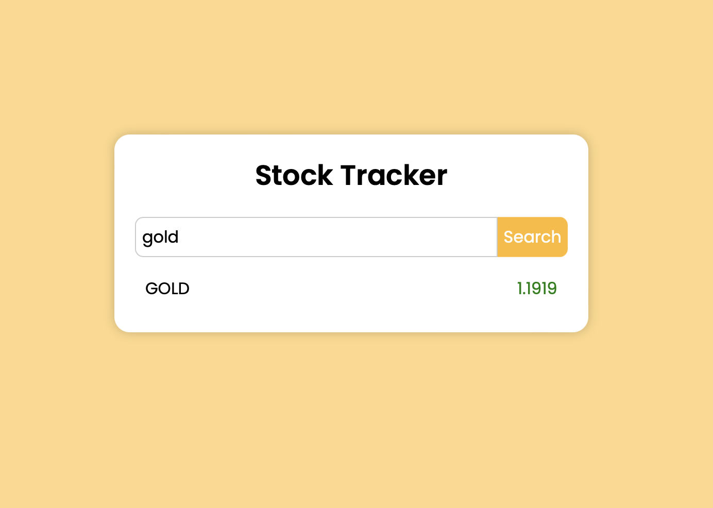

# Stock Tracker App
I am gonna showing to you how to code a stock tracker with javascript. we create a project that you can search stock symbols and see change percentage❗️

##### Line 7 :

```javascript
'https://www.alphavantage.co/query?function=SECTOR&apikey=YOUR_API_KEY'
```

##### Line 37 :

```javascript
https://www.alphavantage.co/query?function=GLOBAL_QUOTE&symbol=${symbol}&apikey=YOUR_API_KEY
```


# Screenshot
Here we have project screenshot :

